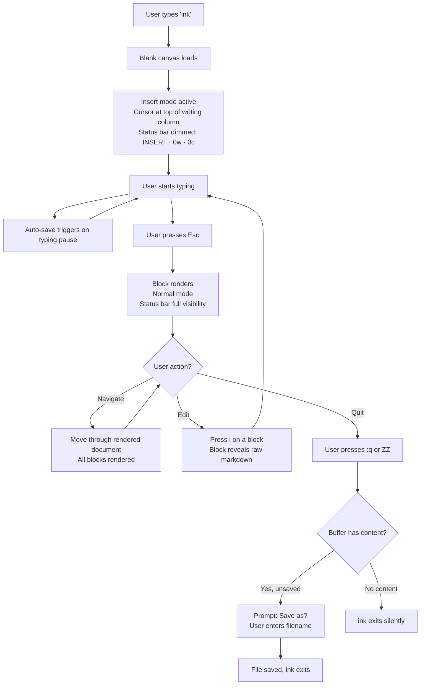
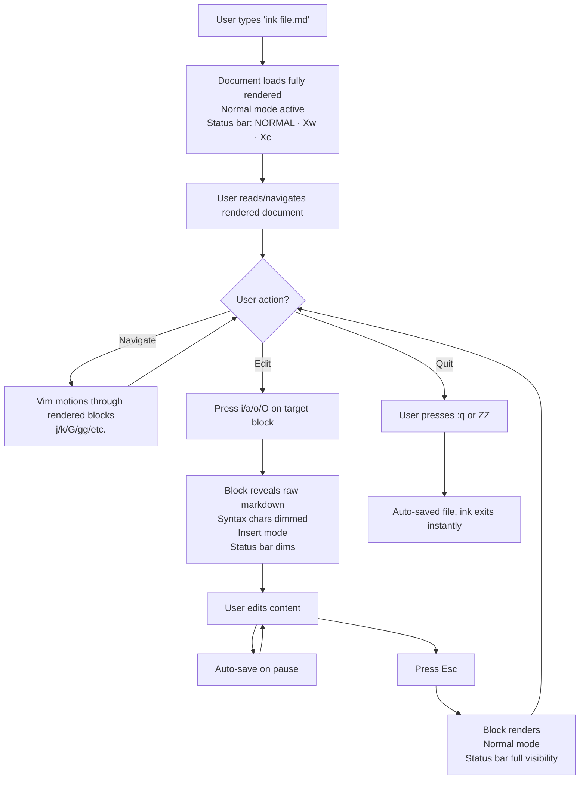
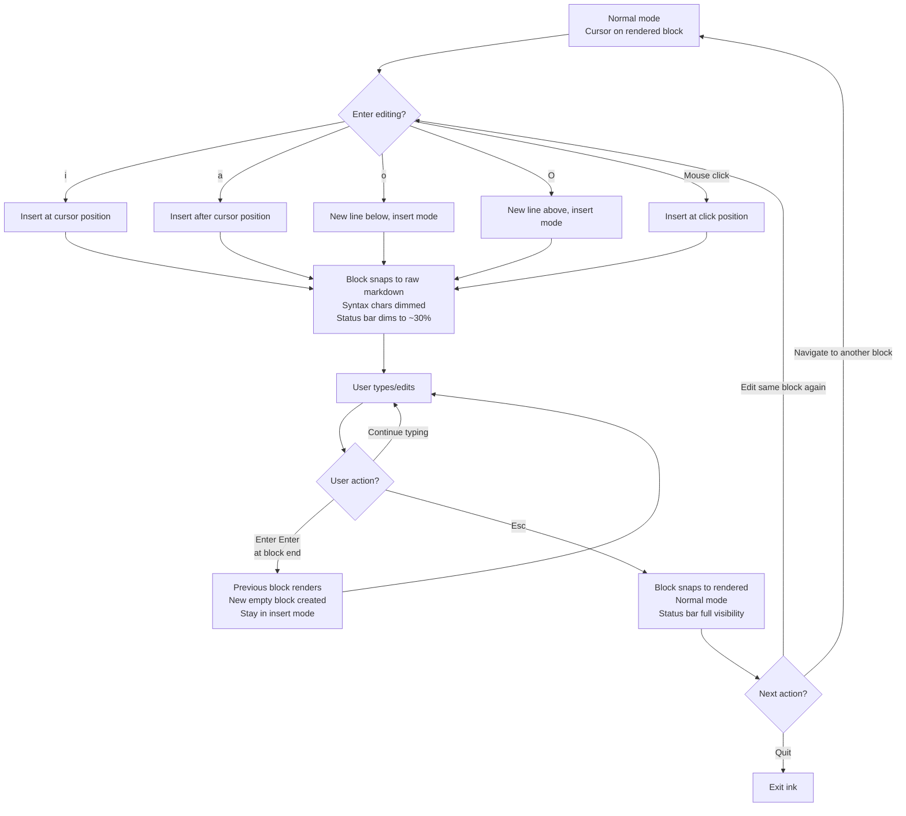
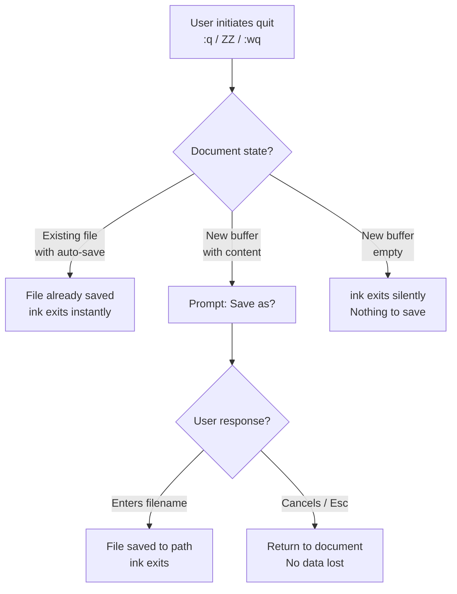

# UX Design Specification ink

**Author:** Matheusmortatti
**Date:** 2026-02-07

---

<!-- UX design content will be appended sequentially through collaborative workflow steps -->

## Executive Summary

### Project Vision

ink is a terminal-native, distraction-free markdown editor that treats writing as its sole purpose. Built with Go and the Charm ecosystem (Bubbletea, Lip Gloss, Glamour), it is the natural complement to glow — where glow renders markdown beautifully for reading, ink provides a beautiful environment for writing it. The core design philosophy is "the invisible tool": every decision is filtered through whether it brings the experience closer to the direct act of writing. The product competes on friction removed, not features added.

Visual references: Obsidian for inline live preview rendering behavior, AI Writer for the focused, minimal writing experience feel.

### Target Users

A single focused persona: terminal-native writers — developers, technical writers, and creatives who live in the terminal and write prose (blog posts, journals, documentation, essays, long-form fiction). They are comfortable with vim motions and command-line tools, value simplicity over feature richness, and want the gap between "I want to write" and "I am writing" to be measured in seconds. They use full-screen terminals and engage in both quick capture sessions and extended writing sessions.

### Key Design Challenges

1. **Block-level editing transitions in TUI** — Implementing Obsidian-style inline live preview (rendered everywhere except the active editing block) is unprecedented in a terminal environment. The snap between rendered and raw markdown must be instant and visually seamless — any flicker or layout shift breaks writing flow. This is the hardest technical UX problem.

2. **Centered prose in a monospace grid** — Achieving a comfortable reading column within the constraints of terminal character cells and monospace fonts requires careful width calculation, responsive behavior to terminal resizes, and graceful handling of the inherent visual limitations of the grid.

3. **Fading UI without animation** — The bottom bar must communicate vim mode state while disappearing in insert mode. With zero animations (all transitions snap), the dim/visible transition must feel intentional and clean rather than jarring. Finding the right dim level is critical.

4. **Full markdown complexity inline** — Supporting the full range of markdown features (tables, nested lists, code blocks, blockquotes, images as placeholders) means every element must render beautifully AND transition cleanly between rendered and raw-editing states.

### Design Opportunities

1. **The blank canvas moment** — No terminal tool opens to a truly empty, centered, writing-ready space. This first impression is the brand — the right amount of nothing, communicating "start writing" without instruction.

2. **Mode-aware UI density** — Using vim modes to control UI visibility is novel. Insert mode = maximum invisibility (just words). Normal mode = chrome appears. This creates a natural rhythm where the tool literally disappears when writing and reappears when navigating.

3. **Focus modes as writing mood** — Typewriter mode (fixed cursor, scrolling document) and fade mode (dim non-adjacent lines) combined can rival dedicated GUI distraction-free writing apps. No terminal tool offers this today.

## Core User Experience

### Defining Experience

The core experience of ink is seamless markdown writing with live preview. The most frequent user action is simply typing prose in insert mode. The critical interaction that carries the entire product is the block-level transition: moving into a block reveals raw markdown for editing, moving out snaps it to rendered markdown. If this single interaction feels instant and seamless, everything else follows. If it doesn't, the product fails.

The core loop is: write → see it rendered as you move through the document → revise → write. But the loop is invisible — the user just experiences "writing."

### Platform Strategy

- **Platform:** Terminal-only TUI application built with Go and Bubbletea/Lip Gloss/Glamour (Charm ecosystem)
- **Input:** Keyboard-primary with vim motions (normal, insert, visual modes), mouse as secondary support
- **Display:** Full-screen terminal, leveraging ANSI colors, unicode rendering, and true color support
- **Environment:** Local-only tool, no network dependencies, no offline considerations
- **Performance constraint:** Near-instant startup (comparable to vim), zero-latency block transitions

### Effortless Interactions

These interactions must require zero conscious thought from the user:

1. **Starting a session** — `ink` or `ink file.md` opens immediately to a writing-ready state. No decisions, no loading screens, no configuration prompts.
2. **Saving work** — Auto-save on typing pause. The user never manually saves, never worries about data loss, never sees a save dialog.
3. **Quitting** — Saves and exits instantly. Unsaved buffers with content prompt once for file location. Empty buffers silently discarded.
4. **Block transitions** — Cursor enters a block: raw markdown with syntax highlighting appears. Cursor leaves: rendered markdown snaps in. No user action required, no perceivable delay.
5. **Mode awareness** — Insert mode hides chrome, normal mode reveals it. The UI responds to the user's intent automatically.

### Critical Success Moments

1. **"It just works"** — The first time a user moves out of a paragraph and watches it snap into beautifully rendered markdown. This is the moment they understand what ink is and why it exists.
2. **The invisible session** — The first complete writing session where the user never consciously thought about the tool. The product thesis — the invisible tool — validated.
3. **"Faster than Obsidian"** — Typing `ink` and being in a writing state before a GUI app would have finished launching. The terminal advantage made tangible.
4. **Make-or-break** — The block transition (raw ↔ rendered). If it feels laggy, causes layout shifts, or flickers, the entire product fails regardless of everything else.

### Experience Principles

1. **Writing is the product** — The act of typing prose is not a feature of ink, it *is* ink. Every design decision serves the typing experience first. If a feature doesn't make writing better, it doesn't belong.
2. **Invisible by default, present when needed** — The tool disappears in insert mode and reappears in normal mode. UI chrome, status, and controls exist only when navigating, never when writing.
3. **Zero-decision startup** — The path from intent to writing contains no decisions. No file dialogs, no template choices, no configuration. `ink` → cursor → words.
4. **The preview is the document** — Rendered markdown isn't a separate view — it's how the document looks. Raw markdown is the exception (active block only), not the rule.
5. **Transitions are instant or they don't exist** — Block rendering snaps. Mode changes snap. No "almost loaded" states. If it can't be instant, it's a bug.

## Desired Emotional Response

### Primary Emotional Goals

ink's emotional signature is **calm, focused, and seamless**. The tool creates an environment of quiet competence where the user's creativity is enabled by the absence of friction. Users should feel that ink is unintrusive — out of their way entirely — and that the tool exists to serve their words, not to be noticed.

The word users reach for when describing ink to others is "seamless." Not powerful, not beautiful, not feature-rich — seamless. The highest compliment is that there's nothing to describe because nothing got in the way.

### Emotional Journey Mapping

| Stage | Desired Emotion | What Triggers It |
|-------|----------------|-----------------|
| **Discovery** | Curiosity + recognition | "glow for writing" pitch clicks instantly — "this is what I've been looking for" |
| **First launch** | Calm surprise | Blank canvas communicates "nothing to figure out" — relief at no setup or decisions |
| **Core writing** | Flow state | Tool disappears, calm focus takes over, creativity flows — user forgets they're in a terminal |
| **Block transition** | Quiet delight | Subtle, satisfying "oh, that's nice" — confirms the tool is well-made without demanding attention |
| **After a session** | Peaceful accomplishment | The weight of "I need to write that" is lifted — file saved, it's done |
| **Error/unexpected** | Confidence | Auto-save means nothing is lost — the tool never puts the user's work at risk |
| **Returning** | Familiarity | No re-learning, no re-configuring — muscle memory, exactly as expected |

### Micro-Emotions

The critical emotional states ink must cultivate:

- **Confidence over confusion** — The user always knows what mode they're in and what will happen next. No ambiguity in state or behavior.
- **Trust over skepticism** — Auto-save builds trust incrementally. The user never worries about losing work. The tool earns trust by being reliable, not by promising reliability.
- **Satisfaction over delight** — ink doesn't try to surprise or impress. It earns quiet satisfaction through consistency. Delight is reserved for the rendered markdown — the content the user created, not the tool itself.

Emotions to actively avoid:
- **Anxiety** — about losing work, not knowing commands, or breaking something
- **Overwhelm** — from features, options, or UI elements
- **Self-consciousness** — about vim proficiency or markdown syntax knowledge
- **Friction frustration** — any moment where the user thinks about the tool instead of their writing

### Design Implications

- **Calm + focused** → Minimal UI elements, muted color palette, no visual noise. The writing column is the only thing that demands attention. Chrome dims or disappears in insert mode.
- **Seamless** → Block transitions must be imperceptible as "transitions" — they should feel like the document simply *is* that way. No flash, no slide, no redraw artifact.
- **Unintrusive** → No notifications, no popups, no tooltips, no welcome screens. Information appears only in the bottom bar and only when the user is in normal mode.
- **Trust** → Auto-save is silent and reliable. Quit behavior is predictable. The tool never asks "are you sure?" because it never puts the user in a position to lose anything.
- **No self-consciousness** → Mouse support as a safety net for non-vim users. No judgment in the UI about how the user navigates. No "you could do this faster with..." hints.

### Emotional Design Principles

1. **Earn trust through silence** — The tool proves its reliability by never demanding attention. No save confirmations, no success messages, no "your file has been saved" toasts. It just works.
2. **Calm is a feature** — Every visual choice (color, spacing, density) should lower the user's heart rate, not raise it. The terminal is already a calm environment — ink amplifies that quality.
3. **Delight belongs to the writer, not the tool** — The beautiful thing on screen is the user's rendered prose, not ink's UI. The tool's job is to make the writer's content look good, not to look good itself.
4. **Never punish, never gatekeep** — No vim expertise required to start writing. No markdown expertise required to see results. The tool meets the user where they are.

## UX Pattern Analysis & Inspiration

### Inspiring Products Analysis

**WordGrinder — The Writing Soul**
- Instant startup, zero-config, opens straight to writing. Proves a terminal tool can feel like a writing tool, not a code editor. The emotional experience of opening WordGrinder and immediately typing is the exact feeling ink must replicate.
- **Key lesson:** The fastest path from intent to writing wins. Every millisecond of startup and every decision before the first keystroke is friction.
- **Limitation to surpass:** Proprietary format, no markdown, no rendering. ink takes WordGrinder's soul and adds what it lacks.

**glow — The Visual Standard**
- Glamour-powered markdown rendering is the visual benchmark ink inherits. Proves beautiful markdown is achievable in the terminal. Vim-style navigation feels natural for scrolling through content.
- **Key lesson:** The rendering quality is already solved in the Charm stack — ink doesn't need to invent a visual language, it needs to extend glow's into an editing context.
- **Limitation to complete:** Read-only. ink completes the story glow started — the write-side complement.

**Obsidian — The Interaction Model**
- Inline live preview (block-level rendering with raw editing on the active block) is the exact interaction model ink brings to the terminal. Obsidian proved this pattern works for writers.
- **Key lesson:** The block-level edit/render paradigm is intuitive — users understand it immediately. The rendered document *is* the editing surface.
- **Limitation to avoid:** GUI-only, feature-heavy, knowledge-management baggage. ink takes the interaction model and strips everything else.

**AI Writer — The Emotional Reference**
- Focused, distraction-free writing with a calm aesthetic. The feeling of opening AI Writer — quiet, centered, ready — is the emotional target for ink.
- **Key lesson:** The "blank page that invites writing" is a specific visual design achievement, not an absence of design. The right amount of nothing is intentional.

**Charm Ecosystem — The Family Identity**
- Across glow, soft-serve, mods, and other Charm tools: zero-config defaults, muted-but-warm color palette via Lip Gloss, clean spacing, unix-philosophy integration, and a sense of craftsmanship. ink must feel like it belongs in this family.
- **Key lesson:** Charm tools share an unspoken visual consistency — similar padding, similar color temperatures, similar information density. ink should feel like a natural sibling, not an adopted child.

### Transferable UX Patterns

**From WordGrinder → ink:**
- Zero-to-writing speed as the primary UX metric
- No splash screen, no welcome message, no tip of the day

**From glow → ink:**
- Glamour rendering as the visual foundation for all rendered blocks
- Vim-style navigation patterns for normal mode movement
- Color palette and visual warmth as the inherited aesthetic

**From Obsidian → ink:**
- Block-level edit/render paradigm — all blocks rendered except active
- Raw markdown with syntax highlighting in the active editing block
- Smooth conceptual transition between "reading my document" and "editing a block"

**From AI Writer → ink:**
- Centered writing column as the default layout
- Progressive UI reduction — less chrome as the user enters deeper focus
- The blank canvas as an intentional design moment, not a loading state

**From Charm ecosystem → ink:**
- Lip Gloss for consistent styling with sibling tools
- Muted, warm color palette — not dark-theme-stark, but dark-theme-comfortable
- Unix-philosophy: do one thing well, integrate with the terminal ecosystem

### Anti-Patterns to Avoid

- **Neovim's configuration burden** — The tool should never require setup to feel right. If a user needs to configure ink to enjoy writing, the defaults have failed.
- **Obsidian's feature weight** — Graph views, plugin browsers, settings panels. Anything that makes the user think "this tool does too much" is an anti-pattern for ink.
- **VS Code's "helpful" interruptions** — Auto-complete popups, lightbulb suggestions, notification badges. Any unsolicited UI element that appears while writing is hostile to ink's emotional goals.
- **Split-pane preview** — The old-school markdown editor pattern of editor-left, preview-right. This doubles the visual noise and breaks the "preview is the document" principle.
- **Mode confusion** — Editors that don't clearly communicate what mode the user is in. ink's bottom bar must make the current mode immediately obvious in normal mode.

### Design Inspiration Strategy

**Adopt directly:**
- Glamour rendering engine and glow's visual quality for rendered markdown blocks
- Lip Gloss styling for consistent Charm ecosystem membership
- Zero-config, instant-startup pattern from WordGrinder
- Block-level edit/render paradigm from Obsidian

**Adapt for terminal:**
- AI Writer's centered, calm aesthetic — translated from GUI proportions to monospace character grid
- Obsidian's inline preview transitions — adapted for terminal rendering constraints (snap instead of animate)
- Progressive UI reduction — adapted as mode-aware chrome (insert = invisible, normal = visible)

**Avoid deliberately:**
- Configuration-dependent experience (Neovim)
- Feature accumulation and plugin ecosystems (Obsidian)
- Unsolicited UI elements during writing (VS Code)
- Split-pane preview paradigm (traditional markdown editors)
- Heavy onboarding or tutorial flows (most modern apps)

## Design System Foundation

### Design System Choice

**Charm-Native Design System** — ink's visual foundation is built entirely on the Charm ecosystem rendering stack: Lip Gloss for component styling, Glamour for markdown rendering, and Bubbletea for the component model. ink inherits glow's visual language as its baseline and extends it into an editing context.

This is not a traditional design system with dozens of components — ink's restraint means the system is deliberately small. The entire UI surface consists of a writing column, rendered blocks, one editing block, a status bar, and a cursor. The design system's job is to ensure these few elements are perfectly consistent and emotionally aligned.

### Rationale for Selection

- **Ecosystem membership:** ink's identity is "the write-side complement to glow." Using Charm's own styling tools ensures ink looks and feels like a native sibling, not a third-party tool.
- **Solo developer efficiency:** Lip Gloss and Glamour provide battle-tested rendering without building a visual framework from scratch. The investment goes into writing experience, not styling infrastructure.
- **Visual consistency for free:** Glamour's default markdown theme is already the visual standard ink targets. Starting from glow's palette means the rendered blocks look right on day one.
- **True color support:** Lip Gloss handles true color natively, enabling precise control over dimming effects, color interpolation, and the subtle visual states ink requires (e.g., insert-mode chrome fading).

### Implementation Approach

**Rendering Stack:**
- **Lip Gloss** — All component styling (status bar, gutter margins, centering, block containers)
- **Glamour** — Markdown rendering for all non-active blocks (inheriting glow's default theme)
- **Bubbletea** — Component architecture, event handling, screen management
- **Bubbles** — Evaluate existing components (text input, viewport) as starting points for ink's editing and scrolling behavior

**Core Components (the complete set):**

| Component | Purpose | Styling Approach |
|-----------|---------|-----------------|
| Writing column | Centered text area, responsive width | Lip Gloss padding/margin for centering |
| Rendered block | Non-active markdown blocks | Glamour with glow default theme |
| Editing block | Active block showing raw markdown | Lip Gloss syntax highlighting styles |
| Status bar | Mode + word count + char count | Lip Gloss with normal/dimmed variants |
| Cursor | Standard terminal cursor | Terminal-native cursor |
| File prompt | Save location on quit (only prompt ink shows) | Lip Gloss minimal input styling |

### Customization Strategy

**Design Tokens:**

| Token | Default | Notes |
|-------|---------|-------|
| Writing column width | 80 chars or 70% of terminal (whichever is smaller) | Configurable via config file |
| Glamour theme | glow default | Single theme, consistent with ecosystem |
| Status bar - normal mode | Lip Gloss styled, full visibility | Mode indicator + word count + char count |
| Status bar - insert mode | ~30% visibility via color interpolation | Foreground colors shifted 70% toward background |
| Fade mode dim level | ~20% visibility for non-adjacent lines | Color interpolation, configurable intensity |
| Background | Terminal default | ink respects the user's terminal theme |

**Dimming Implementation:**
The status bar in insert mode and the fade focus mode both use color interpolation rather than true transparency. For each styled element, a dimmed variant is calculated by interpolating the foreground color toward the background color by a configurable percentage. Lip Gloss's true color support (`lipgloss.Color()` with calculated hex values) makes this precise and consistent across modern terminals.

**What ink does NOT customize:**
- No theme system — one visual identity, done right
- No user-facing color configuration — the Glamour/glow defaults are the brand
- No custom fonts — monospace is the terminal constraint and the design choice
- No border/box-drawing customization — minimal chrome means minimal decisions

## Defining Experience

### The Core Interaction

**"Write markdown and watch it become beautiful as you move through it."**

ink's defining experience is the seamless unity of writing and previewing markdown. The user writes in a document that is always rendered — except for the exact block where they're actively editing. The vim mode system and the block reveal system are unified: entering insert mode reveals raw markdown, returning to normal mode renders it. There is no separate "preview" concept because the document is always previewed.

### User Mental Model

The user thinks: **"I'm editing a beautiful document."** Not "I'm writing raw markdown and sometimes seeing a preview." The rendered state is the default. Raw markdown is a temporary, localized editing surface that appears only when and where needed.

**Key mental model elements:**
- The document looks finished at all times — rendered markdown is the resting state
- The cursor location + vim mode determines what's raw vs. rendered
- Normal mode = reading a beautiful document (glow-like experience with a cursor)
- Insert mode = editing one block while the rest stays beautiful
- Visual mode = selecting across blocks, which reveal raw markdown for precise selection
- Pressing `Esc` is the "completion" gesture — the block renders and the edit becomes part of the document

**What users bring from existing tools:**
- From Obsidian: The block-level edit/render paradigm — intuitive, proven
- From vim/neovim: Modal editing (normal/insert/visual), motions, text objects
- From glow: The expectation that markdown looks beautiful in the terminal
- From any text editor: Typing produces characters, backspace deletes, cursor moves

**Where confusion could arise:**
- Block boundaries may not be obvious in normal mode (everything is rendered) — the user might not know where one block ends and another begins until they enter insert mode
- Multi-line blocks (long paragraphs) in raw markdown may look significantly different from their rendered form, causing a visual "jump" on mode switch
- Users might expect vim's full command set — ink supports a subset (normal, insert, visual only)

### Success Criteria

The defining experience is successful when:

1. **The mode/block transition feels like one action** — Pressing `i` reveals the block AND enters insert mode simultaneously. The user never thinks "first I enter the block, then I start editing." It's one gesture, one result.
2. **The rendered-to-raw snap causes zero layout disruption** — Blocks above and below the active block don't shift position. The writing column stays stable. The user's eyes stay in place.
3. **The raw-to-rendered snap feels like magic the first time** — Pressing `Esc` and watching the block become beautifully formatted is the "it just works" moment. By the tenth time, it's invisible.
4. **The user never thinks about blocks** — The block concept is an implementation detail, not a user concept. The user thinks "I'm editing here" not "I'm in a block."
5. **Normal mode feels like reading** — Navigating in normal mode through a fully rendered document should feel like using glow. The cursor is present but the experience is consumption, not editing.

### Novel UX Patterns

**Pattern: Mode-Unified Block Reveal**

This is a novel combination of established patterns:
- **Established:** Vim modal editing (normal/insert/visual) — users understand this
- **Established:** Obsidian's block-level inline preview — users understand this
- **Novel combination:** Tying the vim mode transition to the block reveal/render transition. No other editor unifies these two concepts.

**How this is learned:**
- No explicit teaching needed — the user presses `i`, the block reveals, they type, they press `Esc`, the block renders. The behavior is self-evident.
- The mental model is simple enough to discover in the first 10 seconds of use
- Mouse users click into a block (which triggers insert mode at click position) — same behavior, different input method

**Why this works:**
- Vim users already context-switch mentally between "navigating" (normal) and "editing" (insert). Mapping visual state to this mental switch reinforces what they already feel.
- The rendered document in normal mode rewards the user for finishing their edit — pressing `Esc` is satisfying because the result is immediately beautiful.

### Experience Mechanics

**Block Definition:**
A block is a paragraph-level markdown element separated by blank lines:
- A heading (single line) = one block
- A paragraph (may be multiple lines) = one block
- A list (all items until the next blank line) = one block
- A code fence (opening to closing fence) = one block
- A blockquote (continuous blockquoted lines) = one block
- A table (header + separator + rows) = one block
- A horizontal rule = one block

**Entering a Block (Insert Mode):**
1. User positions cursor in normal mode (document fully rendered)
2. User presses `i`, `a`, `o`, `O`, or other insert-initiating vim commands
3. The block under the cursor instantly snaps to raw markdown with syntax highlighting
4. Cursor is positioned at the corresponding location within the raw text
5. Status bar shows full visibility (or remains dimmed per insert mode behavior — the bar dims, but the block reveals)
6. All other blocks remain rendered

**Editing Within a Block:**
1. User types, deletes, navigates within raw markdown
2. Block may grow or shrink in line count
3. Surrounding rendered blocks remain stable — no layout shift
4. Auto-pairs active (e.g., `**` auto-completes)
5. Word count in status bar updates in real-time

**Creating New Blocks:**
1. User presses Enter twice at the end of a block (creating a blank line separator)
2. The previous block immediately snaps to rendered
3. Cursor is in a new empty raw block below
4. The split is instant — the user's flow continues uninterrupted

**Leaving a Block (Normal Mode):**
1. User presses `Esc` to return to normal mode
2. The active block instantly snaps to rendered via Glamour
3. The entire document is now fully rendered
4. Cursor remains at its position, now displayed over rendered content
5. The transition is the completion signal — the edit is now part of the beautiful document

**Visual Mode Selection:**
1. User enters visual mode (`v`, `V`, or `Ctrl+V`)
2. The block under the cursor reveals raw markdown
3. As selection extends into adjacent blocks, those blocks also reveal raw markdown
4. Selected text is highlighted over raw markdown for precise selection
5. On exiting visual mode (after yank, delete, or `Esc`), all blocks snap back to rendered

**Mouse Interaction:**
1. User clicks on a rendered block
2. Insert mode is activated at the click position
3. The block reveals raw markdown with cursor at the corresponding raw-text position
4. Behavior is identical to keyboard-initiated insert mode from this point

## Visual Design Foundation

### Color System

**Approach: Terminal-Adaptive**

ink adapts to the user's terminal theme rather than imposing its own background. Whether the user runs a dark or light terminal, ink respects that choice. This is consistent with the "invisible tool" philosophy — the tool fits into the user's environment, not the other way around.

**Color Roles:**

| Role | Source | Usage |
|------|--------|-------|
| Background | Terminal default | ink never sets its own background — it inherits |
| Foreground (prose) | Terminal default foreground | Body text in both raw and rendered blocks |
| Rendered markdown | Glamour adaptive theme | Headings, emphasis, links, code spans — adapts to dark/light |
| Raw markdown syntax | Lip Gloss adaptive colors | Syntax highlighting for markdown in active editing block |
| Status bar (normal) | Lip Gloss styled | Subtle foreground, readable but not attention-grabbing |
| Status bar (dimmed) | Color interpolation ~30% | Foreground shifted 70% toward background |
| Fade mode (dimmed lines) | Color interpolation ~20% | Non-adjacent lines shifted 80% toward background |
| Cursor | Terminal default cursor | ink uses the terminal's native cursor style |

**Glamour Theme Configuration:**
- Use Glamour's adaptive theme (auto-detects dark/light terminal)
- Heading styling: subtle — no heavy borders or boxes, just weight/color differentiation
- Emphasis: italic and bold use foreground color variations, not bright accent colors
- Links: muted accent color, not the typical bright blue — present but not loud
- Code spans: slight background tint or foreground shift, not a full highlight box
- Block quotes: dimmed foreground or subtle indent marker, not a heavy bar

**Color Principles:**
1. **No color demands attention** — Color differentiates elements but never shouts. The brightest thing on screen should be the user's prose, not the formatting.
2. **Adaptive over opinionated** — Respect the user's terminal palette. ink's colors are relative (lighter, darker, dimmer) rather than absolute hex values where possible.
3. **Consistency with glow** — Rendered blocks should look identical to how glow would render the same markdown. The user should feel "this is the same rendering engine."

### Typography System

**Constraints:** Terminal = monospace font, determined by the user's terminal emulator. ink has no control over the typeface itself.

**What ink controls within monospace:**

**Rendered Markdown Hierarchy (Glamour styling):**

| Element | Style | Rationale |
|---------|-------|-----------|
| H1 | Bold, slightly brighter foreground | Primary heading — visible but not heavy. No underlines or box-drawing borders. |
| H2 | Bold | Section markers — clear hierarchy without visual weight |
| H3-H6 | Bold, progressively dimmer | Diminishing hierarchy, all understated |
| Body | Default foreground, no styling | The prose is the product — it should look like natural text |
| Emphasis (*italic*) | Italic (terminal-dependent) or dim | Subtle — the syntax is removed, the intent preserved |
| Strong (**bold**) | Bold foreground | Noticeable but not loud |
| Links | Muted accent color, underline optional | Present but not distracting |
| Code spans | Slight foreground/background shift | Distinct from prose without being a visual interruption |
| Block quotes | Dimmed foreground with indent | Receded from the main text — secondary voice |

**Raw Markdown (Active Editing Block):**

| Element | Style | Rationale |
|---------|-------|-----------|
| Markdown syntax chars (`#`, `*`, `**`, `` ` ``, etc.) | Dimmed/muted color | The syntax is visible but the content stands out |
| Content text | Default foreground | What the user is actually writing stays prominent |
| Cursor line | Standard — no line highlight | No extra visual noise around the cursor |

**Typography Principles:**
1. **Subtle hierarchy** — Headings are differentiated by weight and brightness, not by size (monospace), borders, or decoration. The reader senses the structure without being shown it loudly.
2. **Prose is unstyled** — Body text uses the terminal's default foreground with no additional styling. The words themselves are the visual focus.
3. **Syntax fades, content stays** — In the active editing block, markdown syntax characters are visually receded so the writer reads their words, not the formatting instructions.

### Spacing & Layout Foundation

**Writing Column:**
- Width: 80 characters or 70% of terminal width, whichever is smaller
- Horizontally centered in the terminal via Lip Gloss margin/padding
- Configurable via config file (percentage or absolute character count)
- Minimum width: 40 characters (below this, disable centering and use full terminal width)

**Vertical Spacing:**
- Standard: 1 blank line between rendered blocks (natural markdown spacing)
- No inflated vertical gaps — the "airy" feeling comes from the generous side margins of the centered column, not from excess whitespace between blocks
- Rendered block spacing matches what Glamour produces by default — consistency with glow

**Layout Anatomy (top to bottom):**

```
┌─────────────────────────────────────────────────────┐
│                                                     │
│          ┌─────────────────────────┐                │
│          │                         │                │
│          │   Rendered Block 1      │                │
│          │                         │                │
│          │   Rendered Block 2      │                │
│          │                         │                │
│          │   ══ Active Block ══    │  ← raw markdown│
│          │                         │                │
│          │   Rendered Block 3      │                │
│          │                         │                │
│          └─────────────────────────┘                │
│                                                     │
│  ░░ NORMAL │ 342 words │ 1,847 chars ░░             │
└─────────────────────────────────────────────────────┘
```

- **Gutter (sides):** Dynamic — calculated as `(terminal_width - column_width) / 2`
- **Top margin:** 1 blank line (breathing room from terminal top)
- **Bottom:** Status bar pinned to last terminal row
- **Between status bar and content:** 1 blank line separator

**Blank Canvas Layout:**
When ink opens with no content, the cursor appears at the top of the writing column. No centering the cursor vertically — the writing starts at the top, like a blank page. The vast empty space below is the invitation.

### Accessibility Considerations

**Terminal-Dependent Accessibility:**
ink's accessibility is largely inherited from the user's terminal configuration — font size, color scheme, screen reader compatibility, and high-contrast modes are set at the terminal level. ink respects these by adapting rather than overriding.

**What ink controls:**
- **Contrast ratios:** Glamour's adaptive theme handles dark/light contrast. Dimmed elements (status bar in insert mode, fade mode lines) must remain readable at their reduced visibility — the dim level should be tested to ensure it doesn't drop below WCAG AA contrast ratios against common terminal backgrounds.
- **No color-only signaling:** Vim mode is communicated via text label ("NORMAL", "INSERT", "VISUAL") in the status bar, not by color alone.
- **Mouse as alternative input:** Full mouse support ensures users who can't or prefer not to use keyboard-only vim motions can still navigate and edit.
- **No timing-dependent interactions:** Auto-save triggers on pause but imposes no time pressure. No interactions require fast reaction or precise timing.

## Design Direction Decision

### Design Directions Explored

Four visual directions were explored for ink's TUI, varying across three dimensions:
1. **Status bar position and style** — Left-aligned flat text vs. centered with separators vs. rule-separated
2. **Separator style** — None, pipe characters, thin horizontal rules, middle-dot separators
3. **Active block treatment** — Whether the raw editing block needs a visual boundary or border vs. relying solely on the raw-vs-rendered distinction

### Chosen Direction

**"Centered Calm" — Direction 3 with Direction 4's active block treatment**

The chosen design direction combines:
- **Centered status bar** with middle-dot (`·`) separators — the status bar feels like part of the centered writing composition rather than a separate UI element
- **No active block boundary** — the raw markdown itself (with dimmed syntax characters) is sufficient visual distinction from surrounding rendered blocks. No borders, highlights, or background changes.
- **Dimmed syntax characters** in the active editing block — markdown syntax (`**`, `_`, `#`, `[]()`, etc.) renders at reduced visibility so the content text remains the visual focus even while editing raw markdown

**Key Visual States:**

**Normal Mode:** Fully rendered document, centered status bar at full visibility showing `NORMAL · {words}w · {chars}c`

**Insert Mode:** One block shows raw markdown (syntax dimmed, content bright), all other blocks rendered, status bar dimmed to ~30% showing `INSERT · {words}w · {chars}c`

**Blank Canvas:** Cursor at top of writing column, insert mode active, dimmed status bar showing `INSERT · 0w · 0c`, nothing else on screen

**Startup Mode Logic:**
- Blank/new document → opens in insert mode (the user is here to write)
- Existing document → opens in normal mode (the user is here to read/navigate first)

### Design Rationale

1. **Centered status bar** reinforces the centered writing column — the entire composition is unified around the center axis. Left-aligned chrome would break the visual symmetry that makes the writing space feel intentional.
2. **Middle-dot separators** have the lightest visual weight of any separator option. Pipes (`|`) feel structural, rules feel like borders, dots feel like whispered punctuation. This matches ink's "calm" emotional signature.
3. **No active block boundary** follows the "invisible tool" principle — the less visual infrastructure ink adds, the more the user sees their own words. The raw-vs-rendered distinction is inherent and self-evident; adding a border would be redundant chrome.
4. **Dimmed syntax characters** solve the "raw markdown is visually noisy" problem without hiding the syntax. The writer can see what formatting they've applied while keeping their actual words visually dominant.
5. **Context-aware startup mode** eliminates one micro-decision: blank document means "write now," existing document means "look first." The tool infers intent correctly in both cases.

### Implementation Approach

**Status Bar Component:**
- Lip Gloss centered text within terminal width
- Two style variants: `normal` (full visibility) and `dimmed` (~30% via color interpolation)
- Format: `{MODE} · {word_count}w · {char_count}c`
- Mode label updates on vim mode change, word/char count updates on text change

**Active Block Rendering:**
- Lip Gloss styles for syntax characters: foreground color interpolated ~60% toward background (dimmed but readable)
- Content text within the block: terminal default foreground (full brightness)
- No background change, no border, no margin change — the block occupies the same visual space as its rendered counterpart

**Startup Logic:**
- Check if file argument provided AND file has content → normal mode
- No file argument OR file is empty/new → insert mode
- This is a single conditional at startup, no ongoing complexity

## User Journey Flows

### Journey 1: New Writing Session

**Goal:** User has an urge to write, opens ink, writes prose, saves, and exits.

**Entry point:** Terminal prompt → `ink`



**Key UX moments:**
- Zero decisions between `ink` and typing — blank canvas, insert mode, go
- Auto-save is invisible — the user never knows it's happening
- First `Esc` is the first "magic moment" — the block renders beautifully
- Save prompt only appears once, only when needed

### Journey 2: Edit Existing File

**Goal:** User opens an existing markdown file, reads/navigates, makes edits, and exits.

**Entry point:** Terminal prompt → `ink file.md`



**Key UX moments:**
- Opens in normal mode — user sees the beautiful rendered document first
- Navigation feels like glow — reading a rendered document with a cursor
- Entering insert mode is the moment the user "reaches into" the document
- Quit is instant — auto-save means the file is always current

### Journey 3: Block Editing Cycle

**Goal:** The core interaction loop — enter a block, edit, leave, see the result.

**Entry point:** Normal mode, cursor on a rendered block



**Key UX moments:**
- Multiple entry methods (i/a/o/O/click) all produce the same result — the block reveals
- The double-Enter block split keeps the writer in flow — no interruption
- `Esc` is always the "completion" gesture — satisfying because the result is immediately beautiful
- The cycle is self-reinforcing: edit → see beauty → edit more

### Journey 4: Quit Behaviors

**Goal:** Three distinct quit scenarios, each handled with zero friction.



**Key UX moments:**
- **Existing file:** Instant exit. Auto-save means the file is always current. No "save changes?" dialog.
- **New buffer with content:** One prompt, one time. The only dialog ink ever shows.
- **Empty buffer:** Silent exit. No "are you sure?" for an empty document.
- **Cancel is safe:** If the user cancels the save prompt, they return to their document. Nothing is lost.

### Journey Patterns

**Patterns consistent across all journeys:**

1. **Zero-decision entry** — Every journey starts without requiring a user decision. `ink` opens blank in insert mode. `ink file.md` opens rendered in normal mode. No choices needed.
2. **Auto-save as invisible safety net** — Present in every journey but never visible. The user never thinks about saving, never loses work, never sees a save indicator.
3. **Mode transition as UI transition** — Every journey involves the insert ↔ normal mode switch, which is simultaneously the raw ↔ rendered block switch. One gesture, two state changes, zero confusion.
4. **Instant exit** — Every quit path resolves in one step or zero steps. No multi-dialog flows, no "save all?" patterns.

### Flow Optimization Principles

1. **Minimize steps to writing** — New session: 1 step (type `ink`). Existing file: 2 steps (type `ink file.md`, press `i`). No flow exceeds 2 steps to reach the writing state.
2. **Never interrupt flow state** — Auto-save, auto-pairs, and block splitting all happen without breaking the typing rhythm. The user's fingers never leave the keyboard for a dialog.
3. **Make completion feel good** — Pressing `Esc` should be satisfying, not just functional. The rendered block is the reward. The status bar reappearing is the confirmation.
4. **One prompt, ever** — ink shows exactly one dialog in its entire UX: the save-as prompt for unsaved buffers with content. Every other interaction is zero-prompt.
5. **Recovery is invisible** — Cancel the save prompt? Back to your document. Accidentally quit? Auto-save has your back. There are no failure states the user can reach that lose work.

## Component Strategy

### Design System Components

**From Bubbles (evaluate and extend):**

| Bubbles Component | ink Usage | Adaptation Needed |
|-------------------|-----------|-------------------|
| `viewport` | Base for document scrolling | Heavy — needs block-aware rendering, mixed raw/rendered content, centered column |
| `textarea` | Base for editing block input | Heavy — needs syntax dimming, block-scoped editing, auto-pairs |
| `textinput` | Command input (`:q`, `:wq`) and save prompt | Light — standard single-line input, scoped to status bar area |
| `cursor` | Cursor management | Light — standard cursor, positioned within writing column |
| `key` | Key binding management | Light — vim motion mapping |

**Assessment:** Bubbles provides useful primitives but ink's core components (document viewport, editing block) require substantial custom work. The `viewport` and `textarea` may serve as starting references but will likely need to be reimplemented to support block-aware rendering and the mode-unified reveal system.

### Custom Components

#### 1. Document Viewport

**Purpose:** Display the full document as a scrollable view of rendered and raw blocks within the centered writing column.

**Content:** A sequence of blocks — each either Glamour-rendered (inactive) or raw markdown (active editing block). The viewport composites these blocks into a single scrollable view.

**States:**

| State | Behavior |
|-------|----------|
| Normal mode (all rendered) | Every block rendered via Glamour. Cursor overlays rendered content. Scrollable via vim motions (j/k/G/gg/Ctrl+d/Ctrl+u) and mouse wheel. |
| Insert mode (one block raw) | Active block shows raw markdown. All others rendered. Scroll follows cursor within active block. |
| Visual mode (selection blocks raw) | Selected blocks show raw markdown. Selection highlight overlays raw text. |

**Scroll Behavior:**
- Cursor-follows-viewport: viewport scrolls to keep cursor visible
- Typewriter mode (optional): cursor stays at vertical center, document scrolls around it
- Smooth scroll: not applicable (zero animations) — viewport jumps to new position instantly

**Interaction:** No direct interaction with the viewport itself — all interaction is through vim motions, mouse, or the editing block. The viewport is a passive display surface.

#### 2. Editing Block

**Purpose:** Provide raw markdown editing within a single block when the user enters insert mode.

**Content:** Raw markdown text of the active block, with syntax characters dimmed and content text at full brightness.

**States:**

| State | Behavior |
|-------|----------|
| Active (insert mode) | Accepts text input. Cursor visible. Syntax chars dimmed. Auto-pairs active. Word count updates in real-time. |
| Active (visual mode) | Selection highlight visible over raw text. No text input. Yank/delete operations available. |
| Inactive | Component not rendered — block is displayed as Glamour-rendered instead. |

**Actions:**
- Text input (insert mode)
- Cursor movement within block (arrow keys, vim motions within insert)
- Auto-pair completion (`**`, `__`, `` ` ``, `[]`, `()`)
- Block split (Enter+Enter at block end → previous block renders, new empty block created)
- Exit (Esc → block renders, return to normal mode)

**Boundary behavior:**
- Cursor at first line + up motion → exit block, render, move to previous block (normal mode)
- Cursor at last line + down motion → exit block, render, move to next block (normal mode)
- These boundary exits trigger mode switch back to normal

#### 3. Rendered Block

**Purpose:** Display a non-active markdown block as beautifully rendered content via Glamour.

**Content:** Glamour-rendered markdown output for a single block element (paragraph, heading, list, code fence, table, blockquote, horizontal rule).

**States:**

| State | Behavior |
|-------|----------|
| Default | Glamour-rendered, static display. Part of the document viewport flow. |
| Fade mode active | Content dimmed via color interpolation if not adjacent to the active editing block. |
| Cursor overlay (normal mode) | Cursor is positioned over rendered content. No visual change to the block itself. |

**Interaction:** Click triggers insert mode at the click position → block transitions to Editing Block component.

#### 4. Status Bar

**Purpose:** Display mode, document stats, and command input in a centered, context-sensitive bar at the bottom of the terminal.

**Content:** Context-dependent — either status display or command input.

**States:**

| State | Content | Visibility |
|-------|---------|-----------|
| Normal mode | `NORMAL · {words}w · {chars}c` | Full visibility |
| Insert mode | `INSERT · {words}w · {chars}c` | Dimmed ~30% via color interpolation |
| Visual mode | `VISUAL · {words}w · {chars}c` | Full visibility |
| Command mode | `:{user_input}` | Full visibility, replaces status content |

**Layout:** Centered within terminal width. Middle-dot (`·`) separators between elements.

**Transitions:** All state changes snap instantly — no fade animation between visibility levels.

#### 5. Save Prompt

**Purpose:** Request a file path when quitting with unsaved buffer content. The only dialog ink ever displays.

**Content:** A text input replacing status bar content, prompting for a file path.

**States:**

| State | Behavior |
|-------|----------|
| Active | Status bar shows `Save as: {user_input}` with cursor. Accepts file path input. |
| Confirm | Enter → save file to path, exit ink. |
| Cancel | Esc → return to document, prompt dismissed, no data lost. |

**Interaction:** Standard text input with path completion if feasible. Tab completion for directory navigation would be a nice-to-have but not MVP-critical.

### Component Implementation Strategy

**Build order driven by dependency chain:**

All components share the Lip Gloss styling foundation and operate within Bubbletea's Model-Update-View architecture. Each component is a Bubbletea model that can be composed into the main application model.

**Shared infrastructure:**
- Block parser: splits markdown document into block elements (shared by all block-aware components)
- Style definitions: Lip Gloss styles for normal, dimmed, syntax-dimmed states (shared by all components)
- Glamour renderer: configured once with glow-default adaptive theme (shared by Rendered Block and block transition logic)

### Implementation Roadmap

**Phase 1 — Core (MVP-critical, defines the product):**

| Priority | Component | Rationale |
|----------|-----------|-----------|
| 1 | Block Parser | Foundation — every other component depends on block awareness |
| 2 | Rendered Block | The document must display before it can be edited |
| 3 | Document Viewport | Blocks need to be composed and scrolled |
| 4 | Editing Block | The defining experience — raw editing with syntax dimming |
| 5 | Status Bar | Mode awareness and document stats |

**Phase 2 — Complete (MVP-required, completes the experience):**

| Priority | Component | Rationale |
|----------|-----------|-----------|
| 6 | Command Input (status bar mode) | `:q`, `:w`, `:wq` — required for quit/save |
| 7 | Save Prompt | Required for new-buffer-with-content quit flow |

**Phase 3 — Enhancement (post-MVP):**

| Priority | Component | Rationale |
|----------|-----------|-----------|
| 8 | Focus mode overlays (typewriter, fade) | Optional focus modes layered on existing components |
| 9 | Tab bar | Post-MVP multi-file support |
| 10 | File explorer panel | Post-MVP toggleable side panel |

## UX Consistency Patterns

### Mode Transition Patterns

**Rule: Every mode transition is instantaneous, visual, and reversible.**

| Transition | Trigger | Visual Change | Reversible Via |
|-----------|---------|---------------|----------------|
| Normal → Insert | `i`, `a`, `o`, `O`, mouse click | Active block reveals raw markdown, status bar dims, mode label changes | `Esc` |
| Normal → Visual | `v`, `V`, `Ctrl+V` | Active block reveals raw markdown, selection highlight appears, mode label changes | `Esc` |
| Normal → Command | `:` | Status bar content replaced with `:` + cursor, mode label hidden | `Esc` or `Enter` |
| Insert → Normal | `Esc` | Active block renders, status bar brightens, mode label changes | Any insert trigger |
| Visual → Normal | `Esc`, or after yank/delete | All revealed blocks render, selection cleared, mode label changes | `v`/`V`/`Ctrl+V` |
| Command → Normal | `Esc` (cancel) or `Enter` (execute) | Status bar returns to status display | `:` |

**Consistency rules:**
- `Esc` **always** returns to normal mode from any other mode. No exceptions. No "press Esc twice" patterns.
- Mode label in status bar **always** reflects the current mode (except command mode, where the `:` input replaces the full status bar).
- Visual changes **always** snap instantly. No transition state between modes.
- Every mode has exactly one way out: `Esc` (or `Enter` for command execution).

### Feedback Patterns

**Rule: ink communicates through state, not messages.**

ink has no notification system, no toast messages, no success banners, no modal dialogs (except the save prompt). Feedback is communicated through the existing UI elements changing state.

| Event | Feedback Mechanism | What the User Sees |
|-------|-------------------|-------------------|
| Mode change | Status bar mode label updates | `NORMAL` / `INSERT` / `VISUAL` label changes |
| Text edited | Word/char count updates | Numbers change in status bar in real-time |
| Auto-save triggered | None | Nothing — auto-save is invisible by design |
| Block rendered | Block visual change | Raw markdown snaps to Glamour-rendered output |
| File opened | Document appears rendered | Full rendered document replaces blank canvas |
| Quit successful | Terminal returns | ink exits, terminal prompt appears |
| Command executed | Context-dependent | `:w` → nothing visible (file saved silently); `:q` → ink exits |

**What ink never does:**
- Never shows "File saved successfully"
- Never shows "Auto-save complete"
- Never shows loading spinners or progress bars
- Never shows confirmation dialogs (except save-as prompt)
- Never shows tooltips or hints
- Never plays sounds

**The philosophy:** If the user didn't ask for feedback, don't give it. Trust that things worked. Only communicate failure, never success.

### Error Handling Patterns

**Rule: Errors are communicated in the status bar, never in dialogs or popups.**

Since ink has no modal system beyond the save prompt, errors appear as temporary messages in the status bar area, replacing the normal status content briefly before returning to the standard display.

| Error Scenario | Status Bar Message | Behavior |
|---------------|-------------------|----------|
| File not found | `E: File not found: {path}` | Displayed for 3 seconds, then status bar returns to normal. ink opens blank canvas instead. |
| Permission denied (open) | `E: Permission denied: {path}` | Displayed for 3 seconds, then status bar returns to normal. ink opens blank canvas instead. |
| Permission denied (save) | `E: Cannot save: permission denied` | Displayed for 3 seconds, then status bar returns to normal. Document remains open, no data lost. |
| Disk full (save) | `E: Cannot save: disk full` | Displayed for 3 seconds, then status bar returns to normal. Document remains open, no data lost. |
| Invalid save path | `E: Invalid path: {path}` | Save prompt remains active for retry. User can correct the path or cancel. |
| Unknown command | `E: Not a command: {input}` | Displayed for 3 seconds, then status bar returns to normal. |

**Error consistency rules:**
- All errors use the `E:` prefix for instant recognition
- All status bar errors display for 3 seconds (tunable) then auto-dismiss
- Errors never cause data loss — the document always remains accessible
- Errors never block the user — after dismissal, the user is back to their previous state
- No error requires user acknowledgment (no "OK" button)
- The save prompt is the only error context where the user can retry in-place

### Input Patterns

**Rule: Text input behaves consistently across all input contexts.**

ink has two input contexts: the editing block (prose writing) and the status bar (commands/save prompt). Both follow consistent input conventions.

**Editing Block Input:**

| Input | Behavior |
|-------|----------|
| Printable characters | Inserted at cursor position |
| Backspace | Delete character before cursor |
| Delete | Delete character after cursor |
| Enter | New line within block |
| Enter + Enter | Block split — previous content renders, new empty block |
| Arrow keys | Cursor movement within block |
| Tab | Insert tab/spaces (markdown indentation) |
| Auto-pairs (`**`, `__`, `` ` ``, `[]`, `()`) | Closing character auto-inserted, cursor positioned between |

**Status Bar Input (Command/Save Prompt):**

| Input | Behavior |
|-------|----------|
| Printable characters | Appended to command/path string |
| Backspace | Delete last character of input |
| Enter | Execute command or confirm save path |
| Esc | Cancel — return to normal mode, discard input |
| Tab | Path completion (save prompt only, nice-to-have) |

**Shared conventions:**
- `Esc` always cancels/exits the current input context
- `Enter` always confirms/executes
- Backspace always deletes backward
- No input context traps the user — there's always a way back to normal mode

### Cursor & Navigation Patterns

**Rule: The cursor is always visible and its position always meaningful.**

**Normal Mode Navigation:**

| Motion | Behavior |
|--------|----------|
| `j` / `k` | Move cursor down/up by one line within rendered content |
| `h` / `l` | Move cursor left/right by one character within rendered content |
| `w` / `b` | Move by word forward/backward |
| `G` | Jump to end of document |
| `gg` | Jump to beginning of document |
| `Ctrl+d` / `Ctrl+u` | Half-page down/up scroll |
| Mouse wheel | Scroll document, cursor stays in view |
| Mouse click | Move cursor to click position |

**Cursor position mapping:**
The cursor in normal mode sits over rendered content. When the user enters insert mode, the cursor position must map to the corresponding position in the raw markdown. This mapping must be consistent:
- Cursor on a rendered word → insert mode places cursor at the same word in raw markdown
- Cursor on rendered heading text → insert mode places cursor at the text after the `#` characters
- Cursor on rendered bold text → insert mode places cursor within the `**...**` markers

**Scroll behavior consistency:**
- The viewport always scrolls to keep the cursor visible — the cursor never goes off-screen
- In normal mode, the cursor can be anywhere on the visible page
- In insert mode, the cursor stays within the active block; the viewport scrolls to keep the block visible
- Typewriter mode (optional): cursor locks to vertical center, document scrolls around it. This overrides the default scroll behavior for both normal and insert modes.

**Cursor visual consistency:**
- ink uses the terminal's native cursor style — no custom cursor rendering
- The cursor is always a single character width
- Cursor blink behavior is inherited from terminal settings

## Responsive Design & Accessibility

### Responsive Strategy

**Context:** ink is terminal-only — "responsive" means adapting to terminal dimensions, not device types. There are no breakpoints, media queries, or touch targets. ink adapts to the character grid it's given.

**Principle: Always try your best.** ink never refuses to run regardless of terminal size. It degrades gracefully from luxury (wide terminal, centered column, generous margins) to functional (narrow terminal, full width, no margins) without complaint.

### Terminal Width Adaptation

| Terminal Width | Writing Column | Centering | Margins |
|---------------|---------------|-----------|---------|
| 120+ chars | 80 chars (or configured width) | Centered, generous side margins | `(terminal_width - 80) / 2` per side |
| 80-119 chars | 70% of terminal width | Centered, moderate margins | `(terminal_width - column_width) / 2` per side |
| 40-79 chars | Full terminal width | No centering | No margins — content fills available width |
| Below 40 chars | Full terminal width | No centering | No margins — ink does its best with what it has |

**Resize behavior:**
- ink responds to terminal resize events (SIGWINCH) immediately
- Writing column width recalculates on resize
- Centering recalculates on resize
- Content reflows within the new column width
- Rendered blocks re-render at the new width via Glamour
- The active editing block (if in insert mode) adapts line wrapping to the new width
- All resizing snaps instantly — no animation, no "adjusting..." state

### Terminal Height Adaptation

| Terminal Height | Behavior |
|----------------|----------|
| 10+ rows | Full layout: content area + blank line + status bar |
| 5-9 rows | Content area + status bar (no blank line separator) |
| Below 5 rows | Content area only — status bar hidden, reclaim all rows for writing |

**Height-specific behavior:**
- Status bar always occupies exactly 1 row at the bottom (when visible)
- Scroll behavior adapts: shorter terminals scroll more frequently to keep cursor visible
- Typewriter mode (when enabled) adjusts center point to the available height

### Accessibility Strategy

**Context:** ink's accessibility is primarily inherited from the terminal environment. The user controls font size, color scheme, and screen reader configuration at the terminal level. ink's responsibility is to not break these and to be a good citizen within the terminal's accessibility model.

**Terminal Accessibility Inheritance:**

| Accessibility Feature | ink's Responsibility |
|----------------------|---------------------|
| Font size | Inherited from terminal — ink never sets font size |
| Color scheme (high contrast) | Adaptive colors via Glamour — works with any terminal theme |
| Screen reader | Provide meaningful text content — avoid decorative characters that confuse screen readers |
| Keyboard navigation | Full keyboard control via vim motions — no mouse required |
| Zoom/magnification | Inherited from terminal/OS — ink renders correctly at any character size |

**What ink controls for accessibility:**

1. **Contrast ratios for dimmed elements:**
   - Status bar in insert mode (~30% visibility) must maintain minimum contrast against common terminal backgrounds
   - Fade mode dimmed lines (~20% visibility) must remain legible, not invisible
   - Syntax character dimming (~40% visibility) must keep syntax recognizable
   - Testing: verify contrast ratios against the 10 most common terminal color schemes (Solarized Dark/Light, Dracula, One Dark, Nord, Gruvbox, Tokyo Night, Catppuccin, terminal defaults)

2. **No color-only signaling:**
   - Vim mode communicated via text label (`NORMAL`, `INSERT`, `VISUAL`), not color alone
   - Error messages use `E:` text prefix, not just red coloring
   - Block state (raw vs. rendered) distinguishable by content appearance, not just color

3. **Keyboard-complete operation:**
   - Every action achievable via keyboard — mouse is optional enhancement
   - No hidden keyboard shortcuts — all commands follow vim conventions or are discoverable via `:` commands
   - `Esc` always returns to safe state (normal mode)

4. **Screen reader considerations:**
   - Rendered markdown blocks output clean text (Glamour strips markdown syntax) — screen readers read prose, not formatting characters
   - Status bar is positioned consistently — screen readers can predictably find mode and document stats
   - Minimize decorative Unicode characters (box-drawing, special separators) that may confuse screen readers. The middle-dot (`·`) in the status bar is common enough to be handled well.

### Testing Strategy

**Terminal Compatibility Testing:**

| Test Category | What to Test |
|---------------|-------------|
| Terminal emulators | Kitty, Alacritty, WezTerm, iTerm2, GNOME Terminal, Windows Terminal, tmux, screen |
| Color support | True color (24-bit), 256 color, 16 color — verify graceful degradation |
| Terminal sizes | 20x10 (extreme small), 80x24 (standard), 200x60 (large), resize during operation |
| Unicode support | Verify middle-dot separator, any Unicode in rendered markdown, fallback behavior |
| SSH sessions | Verify behavior over SSH connections with varying terminal capabilities |

**Accessibility Testing:**

| Test Category | What to Test |
|---------------|-------------|
| Contrast ratios | Dimmed elements against 10 common terminal themes |
| Keyboard-only | Complete all user journeys without mouse |
| Screen reader | Test with terminal screen readers (where available) |
| Color blindness | Verify no information conveyed by color alone |

### Implementation Guidelines

**Responsive Implementation:**
- Use Bubbletea's `WindowSizeMsg` to handle terminal resize events
- Recalculate all layout values (column width, centering, margins) on every resize
- Re-render all Glamour blocks at the new width on resize
- Test with rapid resize events to ensure no flickering or crash

**Accessibility Implementation:**
- Use Lip Gloss's `AdaptiveColor` for all color values — automatically adapts to dark/light terminals
- Calculate dimmed colors programmatically from the adaptive base colors, not from hardcoded values
- Keep status bar text content meaningful and consistent for screen reader parsing
- Avoid ANSI escape sequences that might confuse screen readers — use Lip Gloss abstractions instead
